# 3dviewer
一个跨平台的三维模型编辑器，支持多个模型放缩、旋转、矩阵变换，顶点修改，导入obj文件，读取mtl材质文件

### 简介
3dviewer使用了 OpenGL 和 Qt5 进行开发，支持 Windows 和 Linux 平台。
- 可以打开多个 obj 模型，并且内置了正方体、三棱锥、圆锥体、球体、漏斗等十种形状。
- 每一个模型有一个局部矩阵，可以单独对一个模型进行平移、旋转、放缩，也可以对所有模型进行变换
- 可以通过鼠标操作，灵活地修改每一个顶点（平移），也可以删除顶点
- 每一个模型可设置一个纹理。提供了不同角度、多种颜色的光照
- 可以通过键盘、鼠标调整摄像机位置
- 可以将每一个模型保存为 obj 格式
- 支持水晶质感显示模式
- 可以自动读取 mtl 材质文件
- 可以使用矩阵变换加定时器实现旋转等动画

### 部分功能介绍
- 选择模型

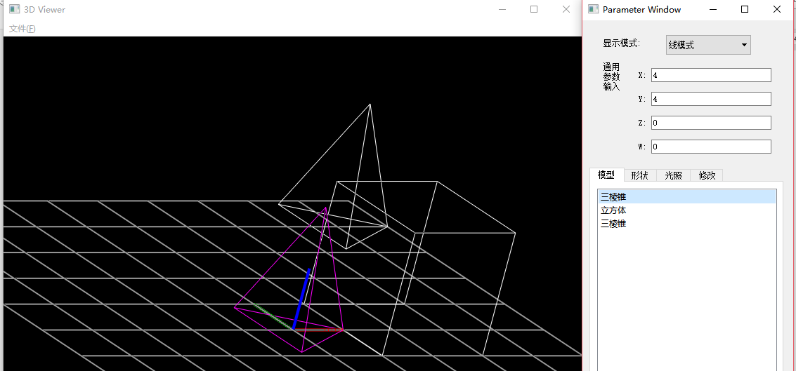

- 修改显示模式

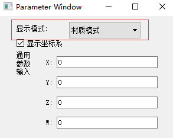

- 材质模式

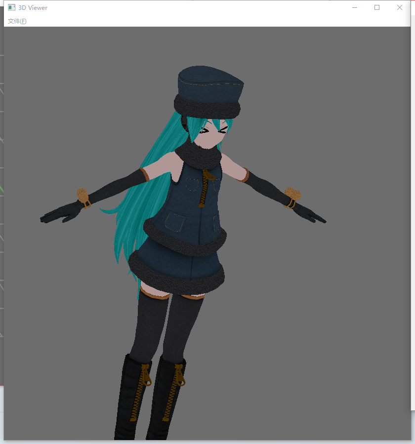

- 水晶质感

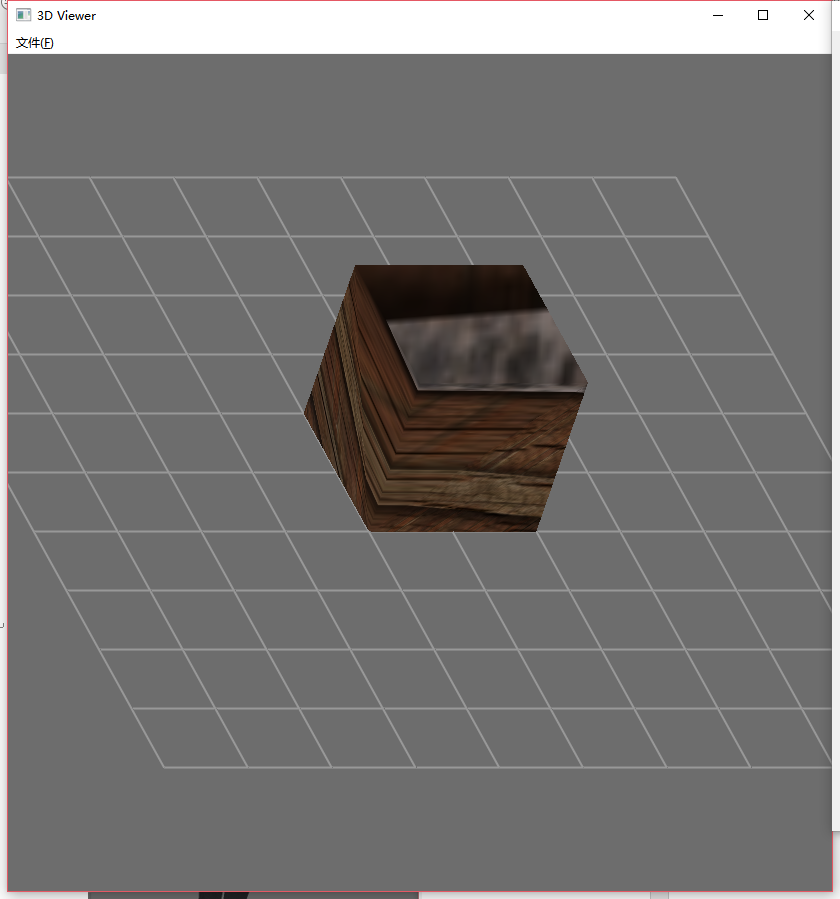

- 修改顶点

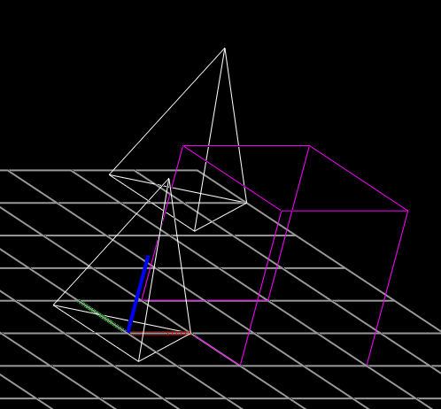

	- 移动顶点

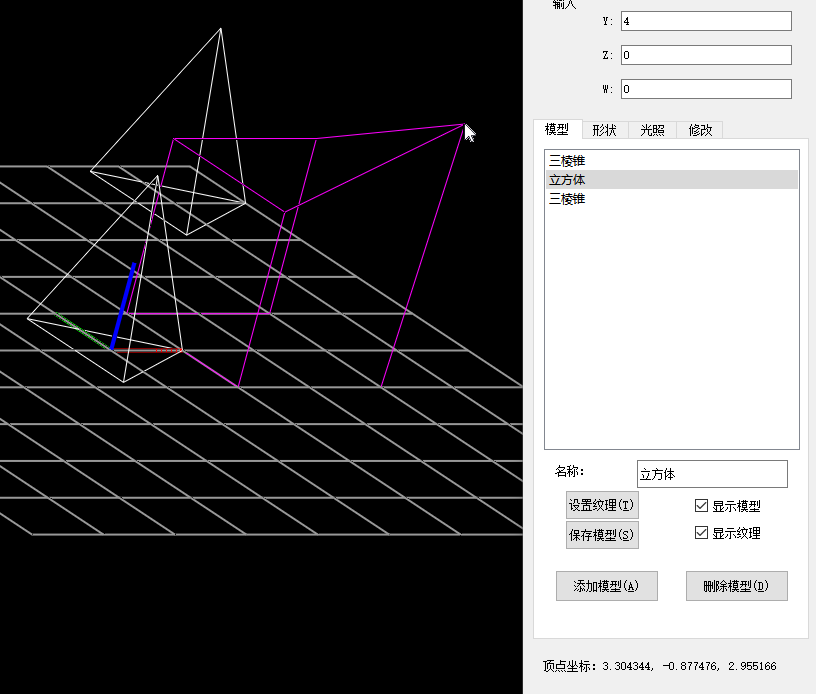

	- 删除顶点

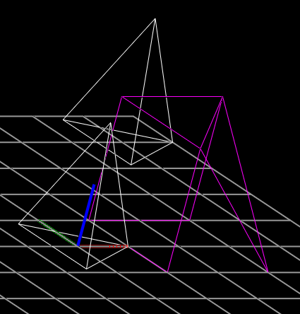

- 修改整个模型

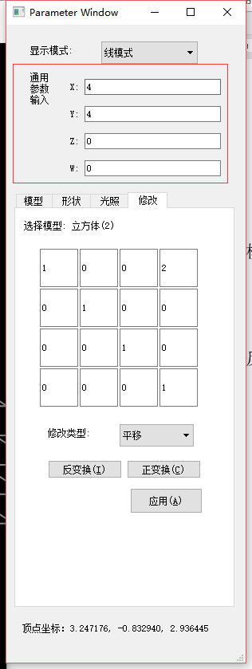
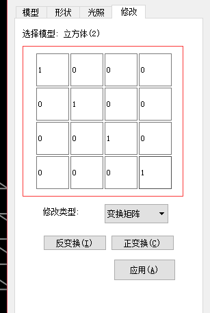

- 局部矩阵

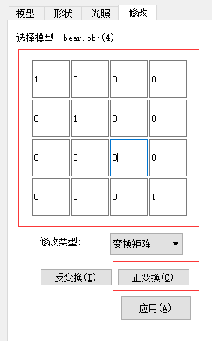
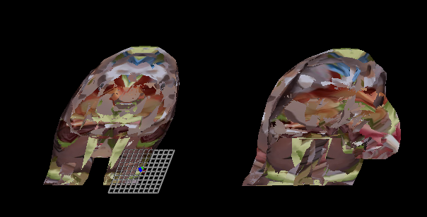

- 动画

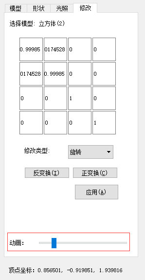
